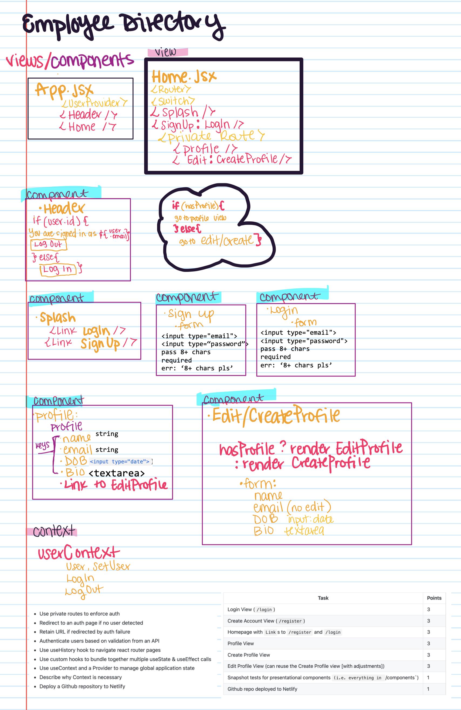

# Employee Directory

## Learning Objectives

Use private routes to enforce auth
Redirect to an auth page if no user detected
Retain URL if redirected by auth failure
Authenticate users based on validation from an API
Use useHistory hook to navigate react router pages
Use custom hooks to bundle together multiple useState & useEffect calls
Use useContext and a Provider to manage global application state
Describe why Context is necessary
Deploy a Github repository to Netlify

## Description

Acme Inc. has hired you to build the company’s Employee Directory app. Acme employees will use the app to sign up for an account and create a personnel profile for use on the Acme intranet. The profile contains the following information:

- Employee Name
- Email (whatever was used to sign up for an account; unchangeable)
- Birthday
- Short bio/”About Me” paragraph
- Dependencies
  Note: This app depends on Supabase and React Router. You’ll need to run npm i for the following packages after setting up your project

@supabase/supabase-js
react-router-dom

## Acceptance Criteria

You will need to create an app that provides the following features:

- Users can create an account
- New accounts will require email confirmation (this comes from Supabase; you don’t need to implement this)
- Users can sign in with their accounts
- Users can sign out after signing in
- When a user signs in:
  - If they haven’t created a profile yet:
    - They are presented with a “Create Profile” view with a message stating they will need to create a profile
      Below the message should be a form with the following inputs:
      name: string
      email: string (disabled; not editable, but still visible in the form)
      birthday: date (you can use input type="date")
      bio: text (you can use textarea)
  - If they have created a profile:
    - They are presented with a profile view page that displays the information from their profile
    - There is a link to the “Edit Profile” view
- The “Edit Profile” view is the same as the “Create Profile” view, but without the message stating they will need to create a profile

- The app should have a header that displays the Acme Inc name and:
  - A “Sign In” button if the user is signed out
  - A “You are signed in as ${email}”` message with a “Sign Out” button if the user is signed in
- The app should have a homepage with some intro content (you can use filler text) and links to “Sign In” and “Create an Account” (which should navigate to the /login and /register paths, respectively)

### Notes

The /services files for interacting with Supabase will be provided for you, as well as the SUPABASE_URL and SUPABASE_KEY environment variables you’ll need to connect to the database
Accounts use email and password authentication, so your registration & login forms will need to take an email (you can use input type="email") and password
Both fields are required
The password should be 8+ characters long
STRETCH: If a field is empty or the password isn’t long enough, an error message should be displayed to the user
Profiles have the following fields: name, email, birthday, and bio
These are the keys you’ll use when sending those values to the server for creating/updating profiles
You should use Context to track the user state.

